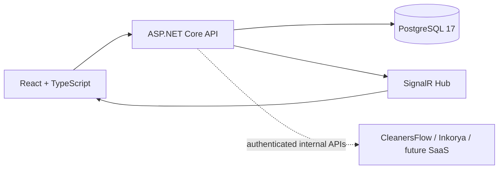

# Zevoryn Control Center Architecture

## System context

The Control Center is a private operator-facing platform for managing multiple Zevoryn SaaS products. It owns only control-plane data and communicates with products through authenticated internal APIs. It never connects directly to a product database.

## Backend layers

`Domain` contains entities and simple invariants. `Application` contains DTOs, service use cases, repository abstractions, and the event publisher abstraction. `Infrastructure` contains EF Core/PostgreSQL persistence. `Api` contains HTTP, ProblemDetails, health checks, DI, and the SignalR adapter. Dependencies point inward: API → Infrastructure → Application → Domain.

## Frontend architecture

Vite serves a React application with React Router, a small typed API client, and SignalR connections for live event activity. Pages do not access PostgreSQL; all data crosses the API boundary. Placeholder routes intentionally contain no future business logic.

## PostgreSQL

The initial schema contains Products, ProductEnvironments, and SaaSEvents. Timestamps are UTC, event payloads are `jsonb`, slugs are unique, and environment names are unique per product. The first migration is `InitialControlCenter`.

## SignalR

`POST /api/events` validates the product/environment relationship, persists the event, then invokes `IControlEventPublisher`. The API adapter publishes `saasEventReceived` through `/hubs/control-events`; the frontend updates its live activity state without a refresh.

## Product-centric design

`ProductId` is the central association key for environments and events. Modules remain separate so Customers, Beta, Monitoring, Billing, Support, AI Lab, and Automation can evolve without making the initial product catalog depend on them.

## Future SaaS integrations

Each SaaS remains the owner of its users, business rules, authentication, tokens, and sensitive data. Future adapters will call authenticated internal APIs or receive authenticated webhooks/polling responses. There is an explicit rule: **the Control Center must not access external SaaS databases directly**.

## Future Beta module

The Beta module will orchestrate campaigns and invitations through the target SaaS internal API. The SaaS will create and validate signup tokens; Control Center will not generate those tokens itself.

## Future AI Lab

AI Lab is currently only a navigation placeholder. It will later manage model development metadata and operations, but this milestone executes no models and stores no model credentials.

## Security evolution

Authentication and operator/RBAC are deliberately deferred. The extension points are the API pipeline, per-integration authenticated clients, secret references rather than plaintext credentials, structured audit events, and a future authorization policy layer. Local CORS and configuration are already environment-driven.

## Local-first deployment strategy

Docker Compose runs PostgreSQL, API, and frontend locally. The API is stateless apart from PostgreSQL and can later be deployed behind TLS with managed PostgreSQL, secret storage, authentication, and restricted network access.
