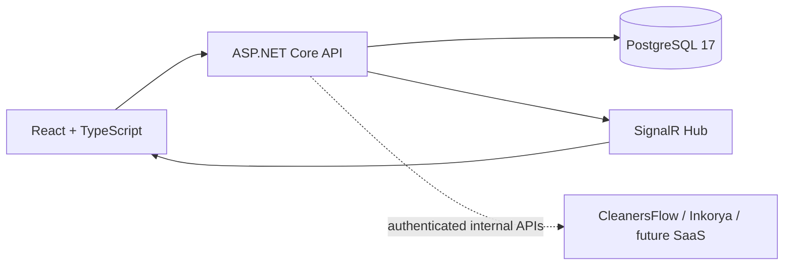

# Zevoryn Control Center Architecture

## System context

The Control Center is a private operator-facing platform for managing multiple Zevoryn SaaS products. It owns only control-plane data and communicates with products through authenticated internal APIs. It never connects directly to a product database.

## Backend layers

`Domain` contains entities and simple invariants. `Application` contains DTOs, service use cases, repository abstractions, and the event publisher abstraction. `Infrastructure` contains EF Core/PostgreSQL persistence. `Api` contains HTTP, ProblemDetails, health checks, DI, and the SignalR adapter. Dependencies point inward: API → Infrastructure → Application → Domain.

## Frontend architecture

Vite serves a React application with React Router, a small typed API client, and SignalR connections for live event activity. Pages do not access PostgreSQL; all data crosses the API boundary. Placeholder routes intentionally contain no future business logic.

## PostgreSQL

The schema contains Products, ProductEnvironments, ProductConnections, and SaaSEvents. Timestamps are UTC, event payloads are `jsonb`, slugs are unique, and environment names are unique per product. Product connections have one connection per type/environment and contain only a logical secret reference. The milestone migration is `AddProductConnectionsAndLifecycle`.

Product deletion is implemented as deactivation to protect future dependent data. Environments can be hard-deleted only when no ProductConnection depends on them; event environment references are nullable and therefore do not block cleanup.

## SignalR

`POST /api/events` validates the product/environment relationship, persists the event, then invokes `IControlEventPublisher`. The API adapter publishes `saasEventReceived` through `/hubs/control-events`; the frontend updates its live activity state without a refresh.

## Product connections and secrets

`ProductConnection` represents an integration capability such as `InternalApi` or `HealthEndpoint`. `SecretReference` is a logical identifier such as `cleanersflow-production-control-api`; no API key, password, or bearer token is persisted. The local `ISecretProvider` maps it to `ZEVORYN_SECRET_CLEANERSFLOW_PRODUCTION_CONTROL_API`. Secret values are never returned by the API or logged. A cloud secret manager can replace this provider later.

## Health-check foundation

`IEnvironmentHealthChecker` uses `IHttpClientFactory`, a five-second timeout, and `{BaseUrl}/health`. Manual checks update the environment status and return status code, latency, message, and UTC checked time. Only absolute HTTP/HTTPS URLs are accepted. This leaves an explicit SSRF hardening task for secure remote deployment: use URL/IP allowlists, private-network egress controls, DNS rebinding defenses, and operator authorization.

## Product-centric design

`ProductId` is the central association key for environments and events. Modules remain separate so Customers, Beta, Monitoring, Billing, Support, AI Lab, and Automation can evolve without making the initial product catalog depend on them.

## Future SaaS integrations

Each SaaS remains the owner of its users, business rules, authentication, tokens, and sensitive data. Future adapters will call authenticated internal APIs or receive authenticated webhooks/polling responses. There is an explicit rule: **the Control Center must not access external SaaS databases directly**.

## Beta Management

BetaCampaign and BetaInvitation are central, product-agnostic orchestration records. Campaigns transition Draft → Active → Paused/Closed, with Paused → Active allowed and Closed terminal. Active invitation capacity counts Pending, Sent, Accepted, and Failed invitations; Revoked and Expired invitations free capacity. A partial unique index prevents duplicate active emails within a campaign.

The current milestone creates only central invitation records. It does not send email, generate invitation tokens, call CleanersFlow, or call Postmark. `ExternalReference` is reserved for a future SaaS invitation identifier. A future `IBetaInvitationProvider` contract can create/revoke invitations in an authenticated product API without exposing raw tokens to Control Center.

The target SaaS remains responsible for token generation, token validation, signup security, and invitation-specific business rules.

## Future AI Lab

AI Lab is currently only a navigation placeholder. It will later manage model development metadata and operations, but this milestone executes no models and stores no model credentials.

## Security evolution

Authentication and operator/RBAC are deliberately deferred. The extension points are the API pipeline, per-integration authenticated clients, secret references rather than plaintext credentials, structured audit events, and a future authorization policy layer. Local CORS and configuration are already environment-driven.

## Integration testing

API integration tests use Testcontainers with an isolated PostgreSQL 17 container and the real API host, EF Core migrations, repositories, ProblemDetails, and endpoints. Tests do not depend on a developer database. Health-check transport tests remain a future addition using a controlled local HTTP server.

## Local-first deployment strategy

Docker Compose runs PostgreSQL, API, and frontend locally. The API is stateless apart from PostgreSQL and can later be deployed behind TLS with managed PostgreSQL, secret storage, authentication, and restricted network access.
